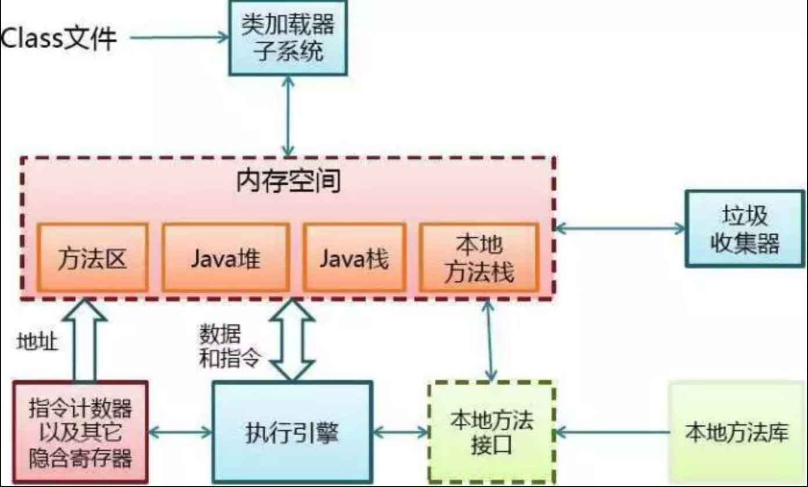
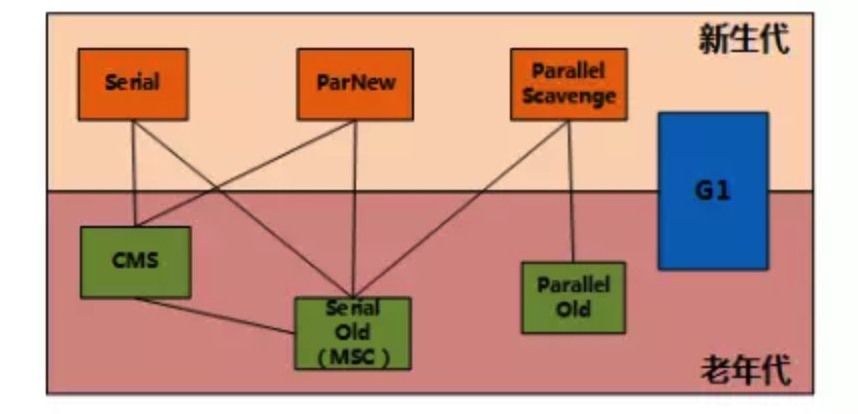

# 1. JVM 

Java 虚拟机包括一套字节码指令集、一组寄存器、一个栈、一个垃圾回收堆和一个存储方法域

JVM 屏蔽了与具体操作系统平台相关的信息，使 Java 程序只需生成在 Java虚拟机上运行的目标代码（字节码），就可以在多种平台上不加修改地运行。JVM 在执行字节码时，实际上最终还是把字节码解释成具体平台上的机器指令执行。

# 2. JRE / JDK / JVM 是什么关系

**JRE(JavaRuntimeEnvironment，Java 运行环境)**，也就是Java平台。所有的 Java 程序都要在 JRE 下才能运行。普通用户只需要运行已开发好 java 程序，安装 JRE 即可。

**JDK(Java Development Kit)** 是程序开发者用来来编译、调试 java 程序用的开发工具包。JDK 的工具也是 Java 程序，也需要 JRE 才能运行。为了保持 JDK 的独立性和完整性，在 JDK 的安装过程中，JRE 也是安装的一部分。所以，在 JDK 的安装目录下有一个名为 jre 的目录，用于存放 JRE 文件。

**JVM(JavaVirtualMachine，Java 虚拟机)** 是 JRE 的一部分。它是一个虚构出来的计算机，是通过在实际的计算机上仿真模拟各种计算机功能来实现的。JVM 有自己完善的硬件架构，如处理器、堆栈、寄存器等，还具有相应的指令系统。Java 语言最重要的特点就是跨平台运行。使用 JVM 就是为了支持与操作系统无关，实现跨平台。

# 3. JVM 的体系结构

类装载器（ClassLoader）：用来装载 .class 文件

执行引擎：执行字节码，或者执行本地方法

运行时数据区：方法区、Java 堆、Java 栈、PC 寄存器、本地方法栈

# 4. JVM 运行时数据区

**第一块：PC寄存器**

PC 寄存器是用于存储每个线程下一步将执行的 JVM 指令，如该方法为 native 的，则 PC 寄存器中不存储任何信息。

**第二块：JVM 栈**

JVM 栈是线程私有的，每个线程创建的同时都会创建 JVM 栈，JVM 栈中存放的为当前线程中局部基本类型的变量（java 中定义的八种基本类型：boolean、char、byte、short、int、long、float、double）、部分的返回结果以及 Stack Frame，非基本类型的对象在 JVM 栈上仅存放一个指向堆上的地址。

**第三块：堆（Heap）**

它是 JVM 用来存储对象实例以及数组值的区域，可以认为 Java 中所有通过 new 创建的对象的内存都在此分配，Heap 中的对象的内存需要等待 GC 进行回收。

（1）堆是 JVM 中所有线程共享的，因此在其上进行对象内存的分配均需要进行加锁，这也导致了 new 对象的开销是比较大的。

（2）Sun Hotspot JVM 为了提升对象内存分配的效率，对于所创建的线程都会分配一块独立的空间TLAB（Thread Local Allocation Buffer），其大小由 JVM 根据运行的情况计算而得，在 TLAB 上分配对象时不需要加锁，因此 JVM 在给线程的对象分配内存时会尽量的在 TLAB 上分配，在这种情况下 JVM 中分配对象内存的性能和 C 基本是一样高效的，但如果对象过大的话则仍然是直接使用堆空间分配。

（3）TLAB 仅作用于新生代的 Eden Space，因此在编写 Java 程序时，通常多个小的对象比大的对象分配起来更加高效。

（4）所有新创建的 Object 都将会存储在新生代 Yong Generation 中。如果 Young Generation 的数据在一次或多次 GC 后存活下来，那么将被转移到 OldGeneration。新的 Object 总是创建在 Eden Space。

**第四块：方法区域（Method Area）**

（1）在 Sun JDK 中这块区域对应的为 PermanetGeneration，又称为持久代。

（2）方法区域存放了所加载的类的信息（名称、修饰符等）、类中的静态变量、类中定义为 final 类型的常量、类中的 Field 信息、类中的方法信息，当开发人员在程序中通过 Class 对象中的 getName、isInterface 等方法来获取信息时，这些数据都来源于方法区域，同时方法区域也是全局共享的，在一定的条件下它也会被 GC，当方法区域需要使用的内存超过其允许的大小时，会抛出 OutOfMemory 的错误信息。

**第五块：运行时常量池（Runtime Constant Pool）**

存放的为类中的固定的常量信息、方法和 Field 的引用信息等，其空间从方法区域中分配。

**第六块：本地方法堆栈（Native Method Stacks）**

JVM 采用本地方法堆栈来支持 native 方法的执行，此区域用于存储每个 native 方法调用的状态。

# 5. 对象“已死”的判定算法

由于程序计数器、Java 虚拟机栈、本地方法栈都是线程独享，其占用的内存也是随线程生而生、随线程结束而回收。而 Java 堆和方法区则不同，线程共享，是 GC 的所关注的部分。

在堆中几乎存在着所有对象，GC 之前需要考虑哪些对象还活着不能回收，哪些对象已经死去可以回收。

**有两种算法可以判定对象是否存活：**

（1）引用计数算法：给对象中添加一个引用计数器，每当一个地方引用了对象，计数器加 1；当引用失效，计数器减 1；当计数器为 0 表示该对象已死、可回收。但是它很难解决两个对象之间相互**循环引用**的情况。

（2）可达性分析算法：通过一系列称为“GC Roots”的对象作为起点，从这些节点开始向下搜索，搜索所走过的路径称为引用链，当一个对象到 GC Roots 没有任何引用链相连（即对象到GC Roots不可达），则证明此对象已死、可回收。Java 中可以作为 GC Roots 的对象包括：虚拟机栈中引用的对象、本地方法栈中 Native 方法引用的对象、方法区静态属性引用的对象、方法区常量引用的对象。

在主流的商用程序语言（如我们的 Java）的主流实现中，都是通过**可达性分析算法**来判定对象是否存活的。

# 6. JVM 垃圾回收

GC (Garbage Collection)的基本原理：将内存中不再被使用的对象进行回收，GC 中用于回收的方法称为收集器，由于 GC 需要消耗一些资源和时间，Java 在对对象的生命周期特征进行分析后，按照新生代、旧生代的方式来对对象进行收集，以尽可能的**缩短 GC 对应用造成的暂停**

（1）对新生代的对象的收集称为 minor GC；

（2）对旧生代的对象的收集称为 Full GC；

（3）程序中主动调用 System.gc() 强制执行的 GC 为 Full GC。

不同的对象引用类型， GC 会采用不同的方法进行回收，JVM 对象的引用分为了四种类型：

（1）强引用：默认情况下，对象采用的均为强引用（这个对象的实例没有其他对象引用，GC 时才会被回收）

（2）软引用：软引用是 Java 中提供的一种比较适合于缓存场景的应用（只有在内存不够用的情况下才会被 GC）

（3）弱引用：在 GC 时一定会被 GC 回收

（4）虚引用：由于虚引用只是用来得知对象是否被 GC

# 7. 垃圾收集算法

**1. 标记-清除算法**

最基础的算法，分标记和清除两个阶段：首先标记处所需要回收的对象，在标记完成后统一回收所有被标记的对象。

它有两点不足：一个效率问题，标记和清除过程都效率不高；一个是空间问题，标记清除之后会产生大量不连续的内存碎片（类似于我们电脑的磁盘碎片），空间碎片太多导致需要分配大对象时无法找到足够的连续内存而不得不提前触发另一次垃圾回收动作。

**2. 复制算法**

为了解决效率问题，出现了“复制”算法，他将可用内存按容量划分为大小相等的两块，每次只需要使用其中一块。当一块内存用完了，将还存活的对象复制到另一块上面，然后再把刚刚用完的内存空间一次清理掉。这样就解决了内存碎片问题，但是代价就是可以用内容就缩小为原来的一半。

**3. 标记-整理算法**

复制算法在对象存活率较高时就会进行频繁的复制操作，效率将降低。因此又有了标记-整理算法，标记过程同标记-清除算法，但是在后续步骤不是直接对对象进行清理，而是让所有存活的对象都向一侧移动，然后直接清理掉端边界以外的内存。

**4. 分代收集算法**

当前商业虚拟机的 GC 都是采用分代收集算法，这种算法并没有什么新的思想，而是根据对象存活周期的不同将堆分为：新生代和老年代，方法区称为永久代（在新的版本中已经将永久代废弃，引入了元空间的概念，永久代使用的是 JVM 内存而元空间直接使用物理内存）。

这样就可以根据各个年代的特点采用不同的收集算法。

新生代中的对象“朝生夕死”，每次 GC 时都会有大量对象死去，少量存活，使用**复制算法**。新生代又分为 Eden 区和 Survivor 区（Survivor from、Survivor to），大小比例默认为 8:1:1。

老年代中的对象因为对象存活率高、没有额外空间进行分配担保，就使用**标记-清除**或**标记-整理**算法。

新产生的对象优先进去 Eden 区，当 Eden 区满了之后再使用 Survivor from，当 Survivor from 也满了之后就进行 Minor GC（新生代 GC），将 Eden 和 Survivor from 中存活的对象 copy 进入 Survivor to，然后清空 Eden 和 Survivor from，这个时候原来的 Survivor from 成了新的 Survivor to，原来的 Survivor to 成了新的 Survivor from。复制的时候，如果 Survivor to 无法容纳全部存活的对象，则根据老年代的分配担保（类似于银行的贷款担保）将对象 copy 进去老年代，如果老年代也无法容纳，则进行 Full GC（老年代 GC）。

大对象直接进入老年代：JVM 中有个参数配置 -XX:PretenureSizeThreshold，令大于这个设置值的对象直接进入老年代，目的是为了避免在 Eden 和 Survivor 区之间发生大量的内存复制。

长期存活的对象进入老年代：JVM 给每个对象定义一个对象年龄计数器，如果对象在 Eden 出生并经过第一次 Minor GC 后仍然存活，并且能被 Survivor 容纳，将被移入 Survivor 并且年龄设定为1。没熬过一次 Minor GC，年龄就加1，当他的年龄到一定程度（默认为15岁，可以通过 XX:MaxTenuringThreshold 来设定），就会移入老年代。但是 JVM 并不是永远要求年龄必须达到最大年龄才会晋升老年代，如果 Survivor 空间中相同年龄（如年龄为 x）所有对象大小的总和大于 Survivor 的一半，年龄大于等于 x 的所有对象直接进入老年代，无需等到最大年龄要求。

# 8. 垃圾收集器

垃圾收集算法是方法论，垃圾收集器是具体实现。JVM 规范对于垃圾收集器的应该如何实现没有任何规定，因此不同的厂商、不同版本的虚拟机所提供的垃圾收集器差别较大，这里只看 HotSpot 虚拟机。

JDK7/8后，HotSpot 虚拟机所有收集器及组合（连线）如下：

**1. Serial 收集器**

Serial 收集器是最基本、历史最久的收集器，曾是新生代手机的唯一选择。他是单线程的，只会使用一个 CPU 或一条收集线程去完成垃圾收集工作，并且它在收集的时候，必须暂停其他所有的工作线程，直到它结束，即“Stop the World”。停掉所有的用户线程，对很多应用来说难以接受。

尽管如此，它仍然是虚拟机运行在 client 模式下的默认新生代收集器：简单而高效（与其他收集器的单个线程相比，因为没有线程切换的开销等）。

**2. ParNew 收集器**

ParNew 收集器是 Serial 收集器的多线程版本，除了使用了多线程之外，其他的行为（收集算法、stop the world、对象分配规则、回收策略等）同 Serial 收集器一样。

是许多运行在 Server 模式下的 JVM 中首选的新生代收集器，其中一个很重要的原因就是除了 Serial 之外，只有他能和老年代的 CMS 收集器配合工作。

**3. Parallel Scavenge 收集器**

新生代收集器，并行的多线程收集器。它的目标是达到一个可控的吞吐量（就是 CPU 运行用户代码的时间与 CPU 总消耗时间的比值，即 吞吐量=运行用户代码的时间/[运行用户代码的时间+垃圾收集时间]），这样可以高效率的利用 CPU 时间，尽快完成程序的运算任务，适合在后台运算而不需要太多交互的任务。

**4. Serial Old 收集器**

Serial 收集器的老年代版本，单线程，“标记整理”算法，主要是给 Client 模式下的虚拟机使用。

另外还可以在 Server 模式下：

JDK 1.5 之前的版本中与 Parallel Scavenge 收集器搭配使用

可以作为 CMS 的后备方案，在 CMS 发生 Concurrent Mode Failure 时使用

**5. Parallel Old 收集器**

Parallel Scavenge 的老年代版本，多线程，“标记整理”算法，JDK 1.6 才出现。在此之前 Parallel Scavenge 只能同 Serial Old 搭配使用，由于 Serial Old 的性能较差导致 Parallel Scavenge 的优势发挥不出来。

Parallel Old 收集器的出现，使“吞吐量优先”收集器终于有了名副其实的组合。在吞吐量和 CPU 敏感的场合，都可以使用 Parallel Scavenge/Parallel Old 组合。

**6. CMS 收集器**

CMS(Concurrent Mark Sweep) 收集器是一种以获取最短回收停顿时间为目标的收集器，停顿时间短，用户体验就好。

基于“标记清除”算法，并发收集、低停顿，运作过程复杂，分4步：

（1）初始标记：仅仅标记 GC Roots 能直接关联到的对象，速度快，但是需要“Stop The World”。

（2）并发标记：就是进行追踪引用链的过程，可以和用户线程并发执行。

（3）重新标记：修正并发标记阶段因用户线程继续运行而导致标记发生变化的那部分对象的标记记录，比初始标记时间长但远比并发标记时间短，需要“Stop The World”。

（4）并发清除：清除标记为可以回收对象，可以和用户线程并发执行。

由于整个过程耗时最长的并发标记和并发清除都可以和用户线程一起工作，所以总体上来看，CMS 收集器的内存回收过程和用户线程是并发执行的。

**CSM 收集器有 3 个缺点：**

**（1）对 CPU 资源非常敏感**

并发收集虽然不会暂停用户线程，但因为占用一部分 CPU 资源，还是会导致应用程序变慢，总吞吐量降低。

CMS 的默认收集线程数量是=(CPU 数量 + 3) / 4；当 CPU 数量多于 4 个，收集线程占用的 CPU 资源多于 25%，对用户程序影响可能较大；不足 4 个时，影响更大，可能无法接受。

**（2）无法处理浮动垃圾**
在并发清除时，用户线程新产生的垃圾叫浮动垃圾，可能出现"Concurrent Mode Failure"失败。

并发清除时需要预留一定的内存空间，不能像其他收集器在老年代几乎填满再进行收集；如果 CMS 预留内存空间无法满足程序需要，就会出现一次"Concurrent Mode Failure"失败；这时 JVM 启用后备预案：临时启用 Serail Old 收集器，而导致另一次 Full GC 的产生；

**（3）产生大量内存碎片：** 
CMS 基于"标记-清除"算法，清除后不进行压缩操作产生大量不连续的内存碎片，这样会导致分配大内存对象时，无法找到足够的连续内存，从而需要提前触发另一次 Full GC 动作。

**7. G1 收集器**

G1（Garbage-First）是 JDK7-u4 才正式推出商用的收集器。G1 是面向服务端应用的垃圾收集器。它的使命是未来可以替换掉 CMS 收集器。

**G1收集器特性：**

并行与并发：能充分利用多 CPU、多核环境的硬件优势，缩短停顿时间；能和用户线程并发执行。

**分代收集：** G1 可以不需要其他 GC 收集器的配合就能独立管理整个堆，采用不同的方式处理新生对象和已经存活一段时间的对象。

**空间整合：** 整体上看采用标记整理算法，局部看采用复制算法（两个 Region 之间），不会有内存碎片，不会因为大对象找不到足够的连续空间而提前触发 GC，这点优于 CMS 收集器。

**可预测的停顿：** 除了追求低停顿还能建立可以预测的停顿时间模型，能让使用者明确指定在一个长度为 M 毫秒的时间片段内，消耗在垃圾收集上的时间不超 N 毫秒，这点优于 CMS 收集器。

**为什么能做到可预测的停顿？**

是因为可以有计划的避免在整个 Java 堆中进行全区域的垃圾收集。

G1 收集器将内存分大小相等的独立区域（Region），新生代和老年代概念保留，但是已经不再物理隔离。

G1 跟踪各个 Region 获得其收集价值大小，在后台维护一个优先列表；

每次根据允许的收集时间，优先回收价值最大的 Region（名称 Garbage-First 的由来）；

这就保证了在有限的时间内可以获取尽可能高的收集效率。

**对象被其他 Region 的对象引用了怎么办？**

判断对象存活时，是否需要扫描整个 Java 堆才能保证准确？在其他的分代收集器，也存在这样的问题（而 G1 更突出）：新生代回收的时候不得不扫描老年代？

无论 G1 还是其他分代收集器，JVM 都是使用 Remembered Set 来避免全局扫描：

每个 Region 都有一个对应的 Remembered Set；

每次 Reference 类型数据写操作时，都会产生一个 Write Barrier 暂时中断操作；

然后检查将要写入的引用指向的对象是否和该 Reference 类型数据在不同的 Region（其他收集器：检查老年代对象是否引用了新生代对象）；

如果不同，通过 CardTable 把相关引用信息记录到引用指向对象的所在 Region 对应的 Remembered Set 中； 

进行垃圾收集时，在 GC 根节点的枚举范围加入 Remembered Set ，就可以保证不进行全局扫描，也不会有遗漏。

不计算维护 Remembered Set 的操作，回收过程可以分为 4 个步骤（与 CMS 较为相似）：

（1）初始标记：仅仅标记 GC Roots 能直接关联到的对象，并修改 TAMS(Next Top at Mark Start) 的值，让下一阶段用户程序并发运行时能在正确可用的 Region 中创建新对象，需要“Stop The World”

（2）并发标记：从 GC Roots 开始进行可达性分析，找出存活对象，耗时长，可与用户线程并发执行

（3）最终标记：修正并发标记阶段因用户线程继续运行而导致标记发生变化的那部分对象的标记记录。并发标记时虚拟机将对象变化记录在线程 Remember Set Logs 里面，最终标记阶段将 Remember Set Logs 整合到 Remember Set 中，比初始标记时间长但远比并发标记时间短，需要“Stop The World”

（4）筛选回收：首先对各个 Region 的回收价值和成本进行排序，然后根据用户期望的 GC 停顿时间来定制回收计划，最后按计划回收一些价值高的 Region 中垃圾对象。回收时采用复制算法，从一个或多个 Region 复制存活对象到堆上的另一个空的 Region，并且在此过程中压缩和释放内存；可以并发进行，降低停顿时间，并增加吞吐量。
